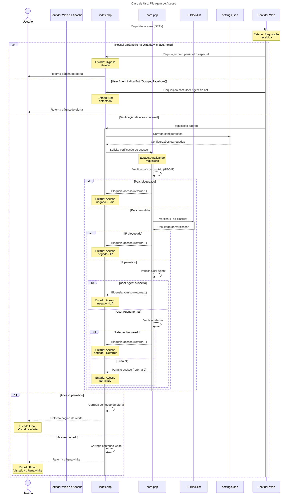

# Diagrama de Sequência: Filtragem de Acesso

Este diagrama mostra o fluxo de filtragem de acesso ao sistema, ilustrando como
o estado varia durante as interações.

## Explicação

Este diagrama mostra o fluxo completo de filtragem de acesso, seguindo estas
etapas:

1. **Estado Inicial**: Usuário faz uma requisição ao servidor
2. **Verificação de Bypass**: Sistema verifica se há parâmetros especiais na URL
3. **Verificação de Bot**: Sistema verifica se o User Agent indica um bot
   conhecido
4. **Verificação de Acesso**: Se não houver bypass ou bot, o sistema realiza
   verificações de:
   - País do usuário (via GEOIP)
   - IP do usuário (verificação em blacklist)
   - User Agent (verificação de padrões suspeitos)
   - Referrer (origem do tráfego)
5. **Estado Final**: Baseado nas verificações, o usuário é direcionado para:
   - Página de Oferta (acesso permitido)
   - Página White (acesso negado)

As fontes de dados utilizadas incluem:

- Arquivo de configuração JSON (settings.json)
- Blacklist de IPs
- Configurações de países permitidos/bloqueados

O diagrama representa apenas um caso de uso (filtragem de acesso) e inclui
somente os objetos diretamente relacionados a esse processo.
