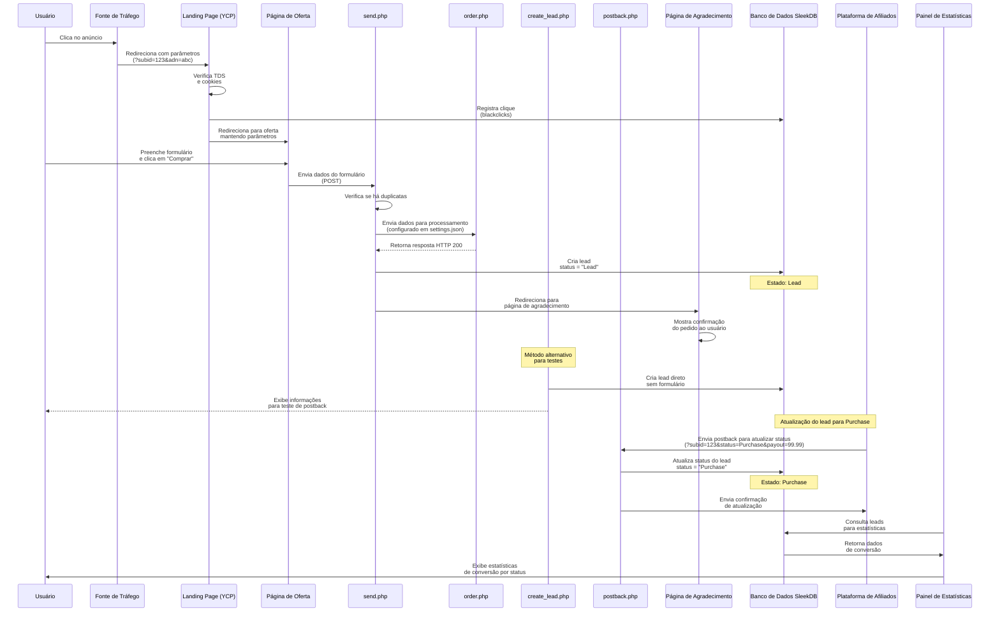

# Diagrama de Sequência: Fluxo de Conversão

Este diagrama ilustra o fluxo completo de conversão desde o clique inicial do
usuário até o registro final na plataforma de afiliados, mostrando todas as
mudanças de estado.



## Descrição do Fluxo

1. **Aquisição do Usuário**:
   - Usuário clica em um anúncio na Fonte de Tráfego
   - É redirecionado para a Landing Page com parâmetros de rastreamento (subid)

2. **Navegação na Oferta**:
   - A Landing Page verifica o TDS e registra o clique no banco de dados
   - Usuário é redirecionado para a página de oferta específica

3. **Conversão Inicial (Lead)**:
   - Usuário preenche o formulário e envia
   - send.php processa os dados e encaminha para order.php
   - send.php cria um lead no banco com status "Lead"
   - Usuário é redirecionado para a página de agradecimento

4. **Método Alternativo para Testes**:
   - O script create_lead.php pode ser usado para criar leads diretamente no
     banco
   - Gera um subid único e registra o lead com status "Lead"
   - Exibe comandos para testar postbacks manualmente

5. **Conversão Final (Purchase)**:
   - A Plataforma de Afiliados envia um postback para atualizar o status
   - postback.php atualiza o status do lead para "Purchase"
   - O sistema confirma a atualização para a Plataforma de Afiliados

6. **Visualização de Estatísticas**:
   - O Painel de Estatísticas consulta o banco de dados
   - As conversões são exibidas classificadas por status (Lead, Purchase,
     Reject, Trash)

Este diagrama representa o caso de sucesso onde um lead é criado e
posteriormente convertido em Purchase, incluindo métodos alternativos para
teste.

## Métodos para Gerar e Testar Conversões

### Método 1: Via Formulário na Página de Oferta

1. Preencher e enviar o formulário em offer1/index.html
2. Os dados são processados por send.php e order.php
3. O lead é criado com status "Lead" (aparece como "Hold" nas estatísticas)

### Método 2: Via Script de Teste Direto

1. Acessar create_lead.php no navegador
2. O script cria automaticamente um lead com dados predefinidos
3. O script exibe um comando curl para testar a atualização do status

### Método 3: Via Postback Manual

```bash
curl -v "http://localhost:8000/postback.php?subid=SUBID_AQUI&status=Purchase&payout=99.99"
```

Este comando atualiza um lead existente para o status "Purchase" e define seu
payout.
