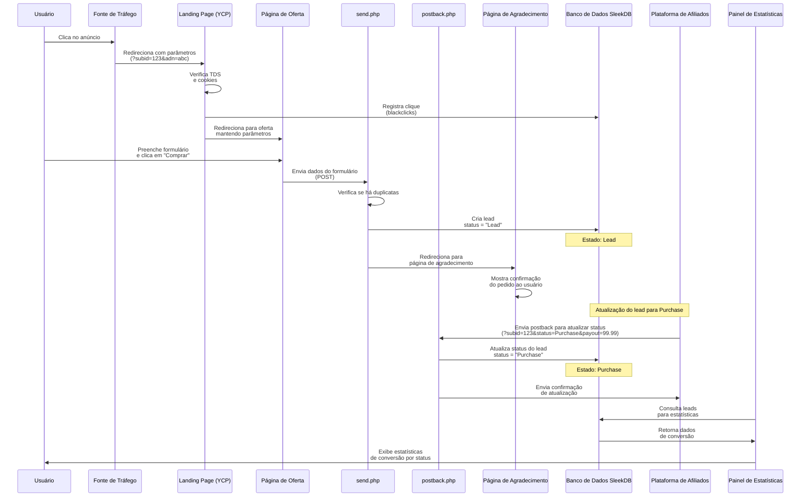

# Diagrama de Sequência: Fluxo de Conversão

Este diagrama ilustra o fluxo completo de conversão desde o clique inicial do
usuário até o registro final na plataforma de afiliados, mostrando todas as
mudanças de estado.

## Descrição do Fluxo

1. **Aquisição do Usuário**:
   - Usuário clica em um anúncio na Fonte de Tráfego
   - É redirecionado para a Landing Page com parâmetros de rastreamento (subid)

2. **Navegação na Oferta**:
   - A Landing Page verifica o TDS e registra o clique no banco de dados
   - Usuário é redirecionado para a página de oferta específica

3. **Conversão Inicial (Lead)**:
   - Usuário preenche o formulário e envia
   - send.php processa os dados e cria um lead no banco com status "Lead"
   - Usuário é redirecionado para a página de agradecimento

4. **Conversão Final (Purchase)**:
   - A Plataforma de Afiliados envia um postback para atualizar o status
   - postback.php atualiza o status do lead para "Purchase"
   - O sistema confirma a atualização para a Plataforma de Afiliados

5. **Visualização de Estatísticas**:
   - O Painel de Estatísticas consulta o banco de dados
   - As conversões são exibidas classificadas por status (Lead, Purchase,
     Reject, Trash)

Este diagrama representa o caso de sucesso onde um lead é criado e
posteriormente convertido em Purchase.
