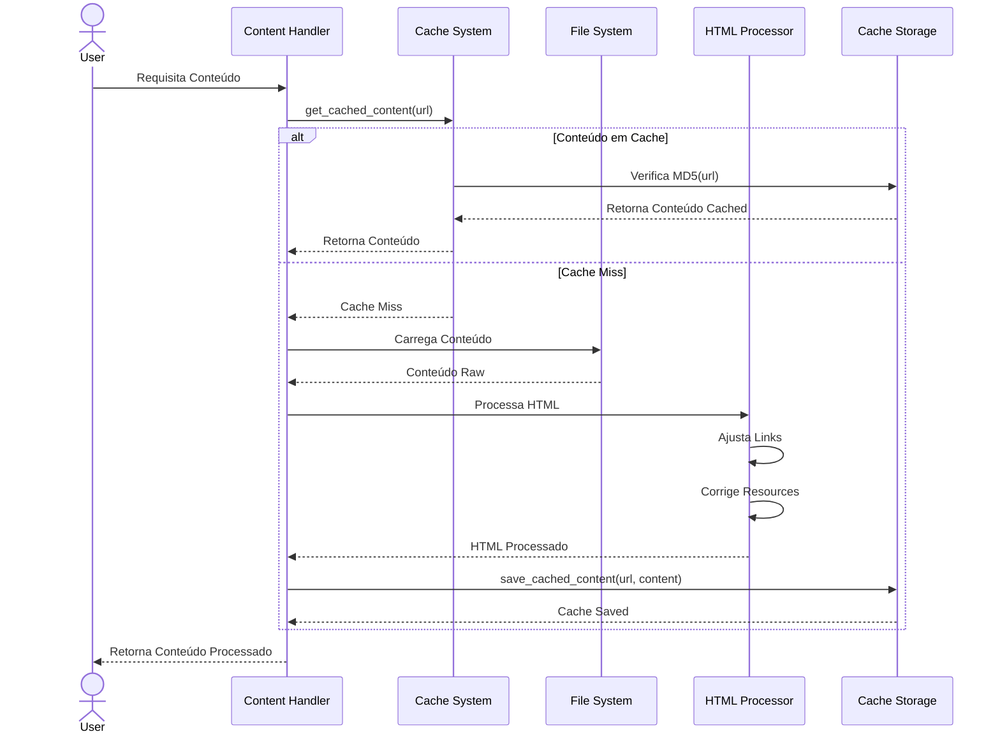

# Atualizações no Sistema de Carregamento de Conteúdo

## Problema Resolvido

As funções de carregamento de conteúdo do sistema (load_landing,
load_white_content e load_white_curl) ocasionalmente apresentavam o erro "Error:
Unable to load content from" quando acessadas com determinados parâmetros,
especialmente com `key=1`.

## Soluções Implementadas

### 1. Sistema de Cache de Conteúdo

Foi implementado um sistema de cache para armazenar o conteúdo carregado das
páginas. Isso traz os seguintes benefícios:

- Reduz significativamente a probabilidade de erros de carregamento
- Melhora o desempenho do sistema, reduzindo chamadas repetidas
- Proporciona maior estabilidade, especialmente para conteúdos externos

Funções implementadas:

- `get_cached_content()`: Verifica e retorna conteúdo em cache
- `save_cached_content()`: Salva conteúdo no cache

### 2. Melhor Tratamento de Erros

As funções de carregamento de conteúdo agora apresentam:

- Verificação explícita de URLs vazias, com valores padrão
- Melhor tratamento para arquivos não encontrados
- Registros de erro mais detalhados via `error_log()`
- Páginas de erro amigáveis em vez de mensagens técnicas
- Verificação de conteúdo vazio após carregamento

### 3. Personalização de Conteúdo

As funções agora verificam e processam adequadamente:

- Pastas personalizadas em `white/` e `offers/`
- Carregamento direto de arquivos index.html
- Acesso à raiz do site (/)

### 4. Diretório de Cache

Um diretório `cache/` foi criado na raiz do projeto para armazenar os arquivos
de cache. Este diretório tem permissões 755 para garantir que o servidor web
possa gravar e ler os arquivos de cache.

## Como Usar o Sistema de Cache

O sistema de cache funciona automaticamente sem necessidade de configuração
adicional. Os arquivos são armazenados por até 1 hora (3600 segundos) por
padrão.

Para limpar o cache manualmente:

```bash
rm -rf cache/*
```

Para ajustar o tempo de expiração do cache, modifique o parâmetro
`$cache_duration` nas chamadas para `get_cached_content()`.

## Considerações Técnicas

- Os arquivos de cache são armazenados usando MD5 da URL como nome de arquivo
- Cada tipo de conteúdo (landing, white, white_curl) tem seu próprio prefixo de
  cache
- O sistema verifica automaticamente a validade do cache com base no tempo de
  modificação do arquivo
- O diretório de cache é criado automaticamente se não existir

## Diagrama de Sequência - Sistema de Cache e Processamento de Conteúdo



## Estados do Sistema Durante o Processamento

1. **Estado Inicial**
   - Sistema recebe requisição
   - Cache não verificado
   - Conteúdo não processado

2. **Estado de Verificação de Cache**
   - Verificando existência no cache
   - Validando tempo de expiração
   - Checando integridade do arquivo

3. **Estado de Processamento**
   - Carregando conteúdo do sistema de arquivos
   - Processando HTML
   - Ajustando links e recursos

4. **Estado de Armazenamento**
   - Salvando conteúdo processado
   - Atualizando cache
   - Definindo tempo de expiração

5. **Estado Final**
   - Conteúdo processado
   - Cache atualizado
   - Resposta enviada ao usuário
