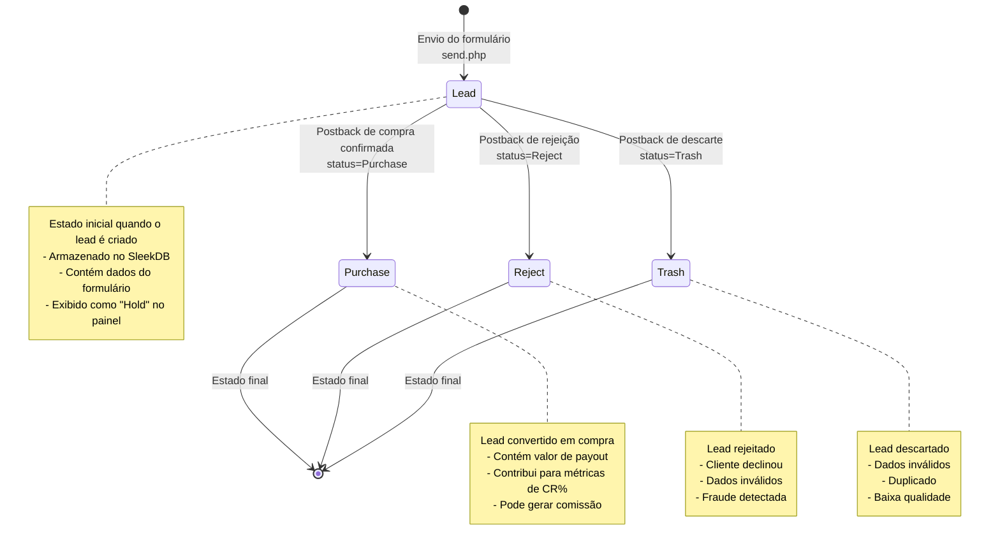

# Diagrama de Estado: Ciclo de Vida do Lead

Este diagrama ilustra as mudanças de estado de um lead ao longo do seu ciclo de
vida, desde a criação até os estados finais.



## Detalhamento dos Estados do Lead

### Estado: Lead

- **Criação**: Quando um usuário preenche o formulário na página de oferta
- **Processamento**: Realizado pelo arquivo `send.php`
- **Dados Armazenados**:
  - subid (identificador único)
  - time (timestamp da criação)
  - name (nome do cliente)
  - phone (telefone)
  - email (se fornecido)
  - fbp, fbclid (parâmetros de rastreamento)
  - preland, land (páginas visitadas)
- **Visualização no Painel**: Aparece como "Hold" nas estatísticas
- **Próximas Transições**: Pode ser atualizado para Purchase, Reject ou Trash

### Estado: Purchase

- **Atualização**: Via postback com `status=Purchase`
- **Processamento**: Realizado pelo arquivo `postback.php`
- **Dados Adicionados**:
  - status = "Purchase"
  - payout (valor da comissão)
- **Significado**: O lead foi convertido em uma compra confirmada
- **Impacto nas Estatísticas**: Aumenta a taxa de conversão (CR%)
- **Estado Final**: Não há mais transições após este estado

### Estado: Reject

- **Atualização**: Via postback com `status=Reject`
- **Processamento**: Realizado pelo arquivo `postback.php`
- **Razões Comuns**:
  - Cliente declinou a oferta
  - Problemas com pagamento
  - Dados de contato inválidos
- **Impacto nas Estatísticas**: Contabilizado separadamente nas estatísticas
- **Estado Final**: Não há mais transições após este estado

### Estado: Trash

- **Atualização**: Via postback com `status=Trash`
- **Processamento**: Realizado pelo arquivo `postback.php`
- **Razões Comuns**:
  - Lead de baixa qualidade
  - Duplicação detectada
  - Fraude ou spam
- **Impacto nas Estatísticas**: Contabilizado nas estatísticas como descartado
- **Estado Final**: Não há mais transições após este estado

## Implementação no Código

Os status são definidos no arquivo `settings.json` e processados pelo
`postback.php`:

```json
"postback": {
    "lead": "Lead",
    "purchase": "Purchase",
    "reject": "Reject",
    "trash": "Trash",
    ...
}
```

A função `update_lead()` no arquivo `db.php` é responsável por realizar a
transição de estado:

```php
function update_lead($subid, $status, $payout) {
    $dataDir = __DIR__ . "/logs";
    $leadsStore = new Store("leads", $dataDir);
    $lead = $leadsStore->findOneBy([["subid", "=", $subid]]);
    
    // ... código de verificação ...
    
    $lead["status"] = $status;
    $lead["payout"] = $payout;
    $leadsStore->update($lead);
    return true;
}
```
