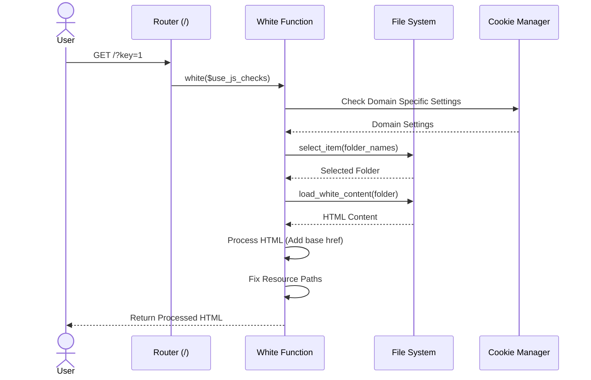
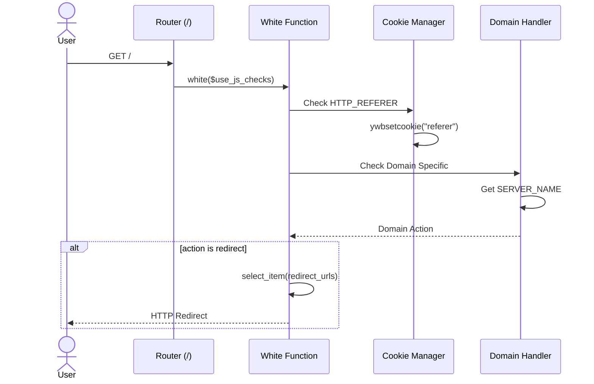
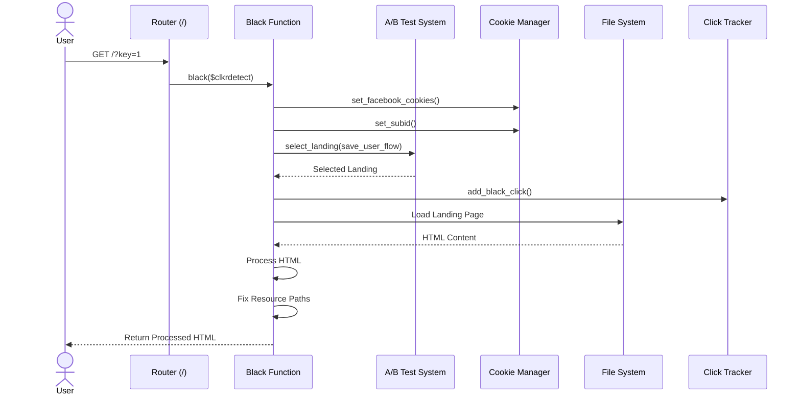
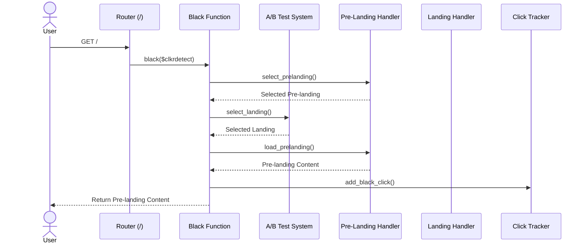

# Diagramas de Sequência - main.php

## Fluxo White - Carregamento Direto de Conteúdo

## Fluxo White - Redirecionamento com Domínio Específico

## Fluxo Black - Landing Page com A/B Testing

## Fluxo Black - Pre-landing com Redirecionamento

