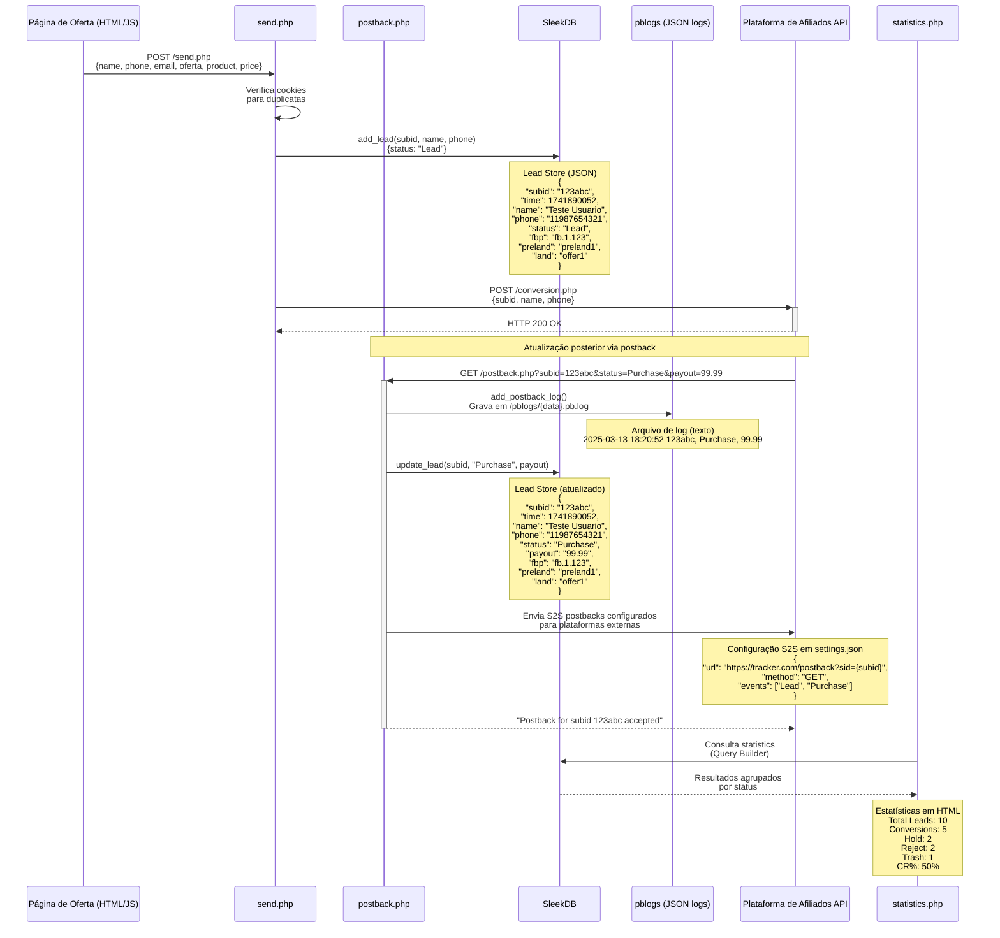

# Diagrama Técnico: Implementação e Estrutura de Dados

Este diagrama detalha a implementação técnica e a estrutura de dados no fluxo de
conversão, com foco nas operações de banco de dados e nos formatos de dados
trocados.



## Detalhamento Técnico

### Estruturas de Dados

1. **Lead no SleekDB**:
   ```json
   {
       "subid": "123abc",
       "time": 1741890052,
       "name": "Teste Usuario",
       "phone": "11987654321",
       "email": "teste@exemplo.com",
       "status": "Purchase",
       "payout": "99.99",
       "fbp": "fb.1.123",
       "fbclid": "abc123",
       "preland": "preland1",
       "land": "offer1"
   }
   ```

2. **Configuração de Postback (settings.json)**:
   ```json
   "postback": {
     "lead": "Lead",
     "purchase": "Purchase",
     "reject": "Reject",
     "trash": "Trash",
     "s2s": [
       {
         "url": "https://tracker.com/postback?sid={subid}&status={status}",
         "method": "GET",
         "events": ["Lead", "Purchase"]
       }
     ]
   }
   ```

3. **Log de Postback**:
   ```
   2025-03-13 18:20:52 123abc, Purchase, 99.99
   2025-03-13 18:21:14 GET https://tracker.com/postback?sid=123abc&status=Purchase 200
   ```

### Implementação dos Principais Componentes

1. **send.php**: Processa o formulário de pedido, verifica duplicatas via
   cookies, cria leads no banco de dados e redireciona para a página de
   agradecimento.

2. **postback.php**: Recebe atualizações de status de leads, atualiza o banco de
   dados, registra logs e envia postbacks S2S configurados para plataformas
   externas.

3. **SleekDB**: Banco de dados JSON que armazena leads, cliques e outras
   informações em arquivos estruturados.

4. **statistics.php**: Consulta o banco de dados para extrair métricas de
   conversão e exibe as estatísticas no painel administrativo.
